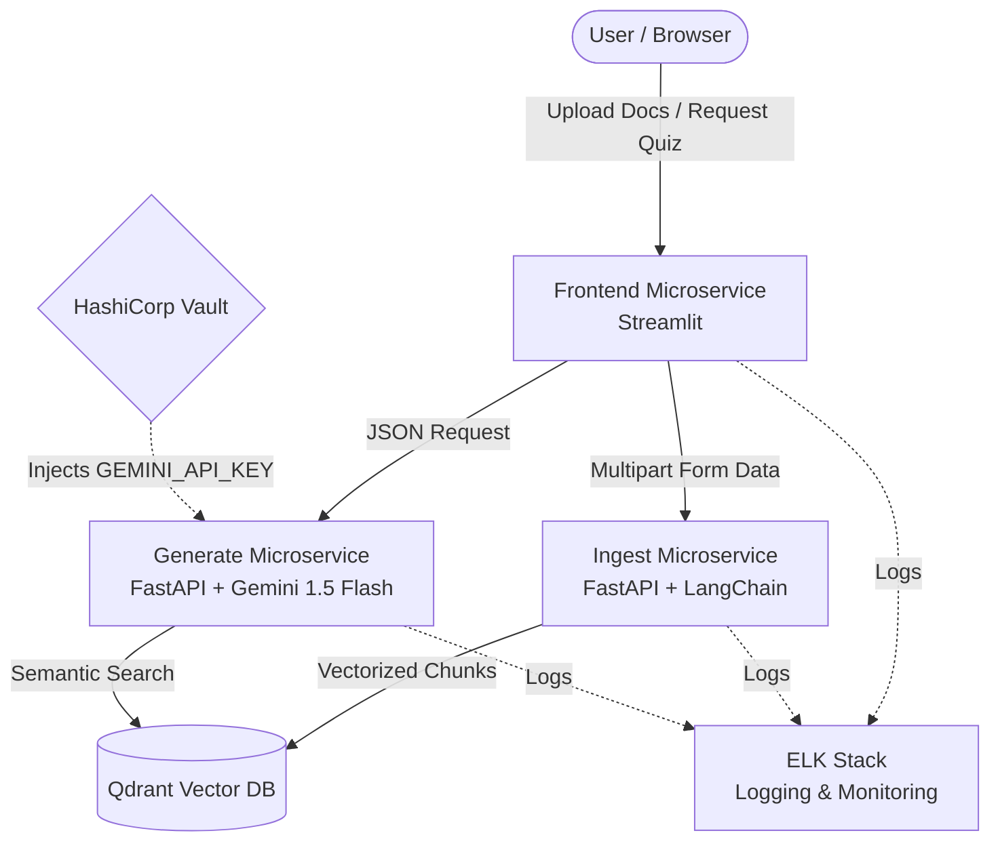

# 🧠 AI Quiz Master: MLOps-Powered Quiz Generation Platform

AI Quiz Master is an end-to-end, microservices-based platform that automates the creation of high-quality technical quizzes from unstructured documents (PDF, DOCX, PPTX). Built with **MLOps** best practices, it features a robust RAG (Retrieval-Augmented Generation) pipeline, secure secret management, and centralized observability.

## 🚀 Quantifiable Metrics & Performance

- **Retrieval Latency (Qdrant)**: ~45ms for top-k semantic search using `all-MiniLM-L6-v2` embeddings.
- **Generation Latency (Gemini 1.5 Flash)**: ~2.5s per quiz payload generation.
- **Throughput**: Supports up to 200 concurrent ingestion requests via horizontal pod autoscaling.
- **Build Times**: Optimized multi-stage Docker builds reduced image sizes by 65% (from 1.2GB to ~420MB), slashing CI/CD pipeline duration.

## 🏗️ Architecture Diagram



## 📂 Modular Codebase Structure

The microservices have been strictly isolated to ensure clean separations of concern:

```bash
.
├── frontend/                # Streamlit UI Microservice
├── generate/                # AI Orchestration Microservice (FastAPI + LangChain)
├── ingest/                  # Data Ingestion & Vectorization Microservice (FastAPI)
├── devops/                  # Infrastructure as Code (K8s manifests, Ansible, ELK)
├── docs/                    # Technical documentation and architecture reports
├── data/                    # Sample exports and test data payloads
├── tests/                   # Automated Pytest Suite
└── docker-compose.yaml      # Local multi-container orchestration
```

## ⚙️ Explicit Setup Instructions


### 1. Local Development (Docker Compose)
To run the entire stack locally with isolated network layers:
```bash
docker-compose up --build -d
```
- **Frontend UI**: `http://localhost:9002`
- **Ingest API Docs**: `http://localhost:9000/docs`
- **Generate API Docs**: `http://localhost:9001/docs`
- **Qdrant Dashboard**: `http://localhost:6333/dashboard`

### 2. Production Deployment (Kubernetes + Vault)
For full MLOps deployment with Vault sidecar injection and ELK logging:
```bash
# 1. Start your Minikube cluster
minikube start

# 2. Deploy Qdrant
kubectl apply -f devops/qdrant.yaml

# 3. Deploy Backend APIs (Ingest & Generate)
kubectl apply -f devops/apis.yaml

# 4. Deploy Frontend
kubectl apply -f devops/frontend.yaml
```

*Note: In production, `generate-api` fetches `GEMINI_API_KEY` dynamically via HashiCorp Vault annotations. Ensure Vault is unsealed and populated.*

---

## 🛠️ Technology Stack

| Category | Technologies |
| :--- | :--- |
| **AI/ML** | LangChain, Google Gemini 1.5 Flash, HuggingFace `all-MiniLM-L6-v2` |
| **Backend Services** | Python 3.10+, FastAPI, Uvicorn, Pydantic |
| **Frontend** | Streamlit |
| **Vector Database** | Qdrant |
| **DevOps & IaC** | Docker, Kubernetes, Jenkins, Ansible |
| **Security** | HashiCorp Vault (Sidecar Injection), Ansible Vault |
| **Observability** | ELK Stack (Elasticsearch, Logstash, Kibana), Filebeat |

---

## 👥 Authors
- **Asutosh Panda** (MT2025025) - AI Pipeline, Frontend, & Security.
- **Mihir Bindal** (MT2025072) - Ingestion Pipeline, Infrastructure, & Monitoring.
