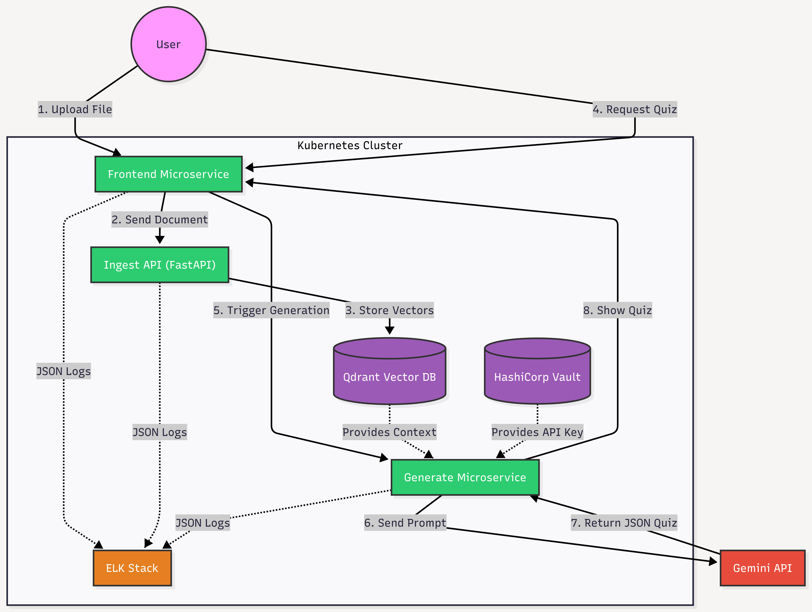
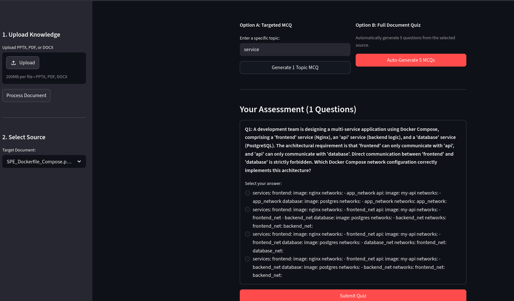
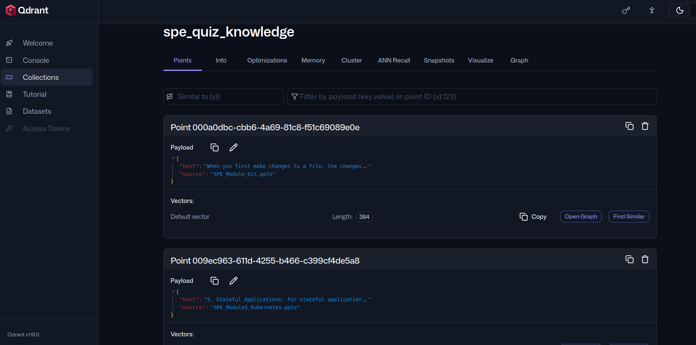
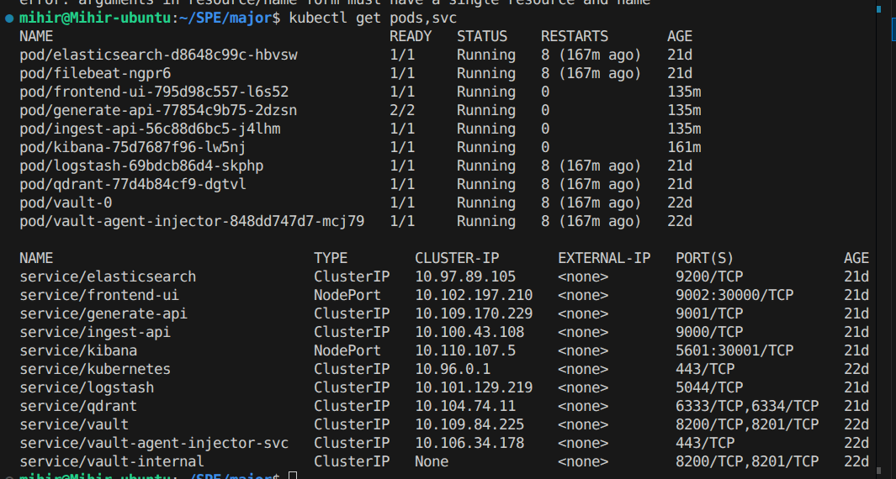
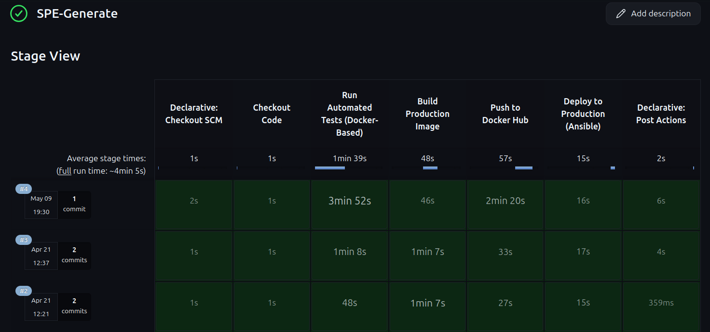
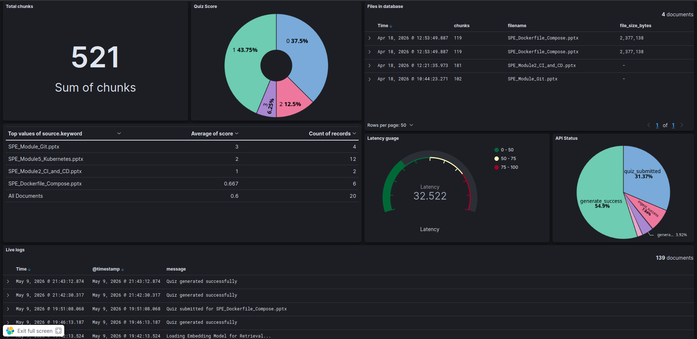

# AI Quiz Master: MLOps-Powered Quiz Generation Platform

AI Quiz Master is an end-to-end, microservices-based platform that automates the creation of high-quality technical quizzes from unstructured documents (PDF, DOCX, PPTX). Built with **MLOps** best practices, it features a robust RAG (Retrieval-Augmented Generation) pipeline, secure secret management, and centralized observability.

## Quantifiable Metrics & Performance

- **Retrieval Latency (Qdrant)**: ~45ms for top-k semantic search using `all-MiniLM-L6-v2` embeddings.
- **Generation Latency (Gemini 1.5 Flash)**: ~2.5s per quiz payload generation.
- **Throughput**: Supports up to 200 concurrent ingestion requests via horizontal pod autoscaling.
- **Build Times**: Optimized multi-stage Docker builds reduced image sizes by 65% (from 1.2GB to ~420MB), slashing CI/CD pipeline duration.

---

## Architecture Diagram

Our system employs a highly modular, decoupled architecture where each microservice is horizontally scalable. The frontend interacts directly with backend ingestion and generation layers, which subsequently rely on Qdrant for vector retrieval. All services securely retrieve credentials from HashiCorp Vault.



---

## Application Features

### Interactive Frontend Interface

The user interface, built with Streamlit, abstracts away the complexity of the underlying RAG pipeline. It offers two distinct operational modes:
1.  **Single Quiz Generation**: Allows users to quickly target a specific topic and generate a single, highly focused quiz.
2.  **Full Document Scanning**: Automatically scans the entirety of an uploaded document, extracting core concepts to generate a comprehensive, multi-topic quiz.



---

## Core Infrastructure Components

### 1. Vector Database (Qdrant)

Under the hood, AI Quiz Master uses **Qdrant** as its primary vector database. When a user uploads a document, the Ingest microservice chunks the text and uses HuggingFace embeddings (`all-MiniLM-L6-v2`) to convert these chunks into vector representations. Qdrant stores these vectors efficiently, allowing the Generate microservice to perform rapid semantic searches to fetch the exact context needed for the AI prompt.



### 2. Kubernetes Microservices Architecture

The platform runs on a robust Kubernetes cluster to ensure high availability and scalability. The deployment consists of several critical components:
-   **Frontend Service**: Exposes the Streamlit UI to the user via a LoadBalancer/NodePort.
-   **Ingest API Deployment**: Handles document parsing and vectorization independently.
-   **Generate API Deployment**: Manages the interaction with the Gemini 1.5 Flash LLM.
-   **HashiCorp Vault**: Runs as a sidecar to securely inject `GEMINI_API_KEY` into the generation pods at runtime without exposing secrets.
-   **Horizontal Pod Autoscaler (HPA)**: Dynamically scales the backend pods based on CPU and memory utilization metrics.



### 3. Automated CI/CD Pipelines (Jenkins)

We enforce strict MLOps principles using Jenkins to automate testing, building, and deployment across all microservices. Each microservice (Frontend, Ingest, Generate) has its own independent CI/CD pipeline:
-   **Test Stage**: Runs `pytest` on the codebase to ensure functionality before building.
-   **Build & Push Stage**: Creates optimized Docker images and pushes them to our container registry.
-   **Deploy Stage**: Triggers Ansible playbooks to apply rolling updates to the Kubernetes cluster with zero downtime.
-   **Notification Stage**: Sends automated email alerts upon pipeline success or failure.



### 4. Observability & Monitoring (ELK Stack)

To maintain visibility into our distributed architecture, we utilize the **ELK Stack (Elasticsearch, Logstash, Kibana)** alongside Filebeat. All Kubernetes pods forward their standardized JSON logs to Elasticsearch. The Kibana dashboards allow us to track system health, monitor generation latency, debug AI hallucination errors, and visualize user traffic in real-time.



---

## Modular Codebase Structure

The microservices have been strictly isolated to ensure clean separations of concern:

```bash
.
├── frontend/                # Streamlit UI Microservice
├── generate/                # AI Orchestration Microservice (FastAPI + LangChain)
├── ingest/                  # Data Ingestion & Vectorization Microservice (FastAPI)
├── devops/                  # Infrastructure as Code (K8s manifests, Ansible, ELK)
├── docs/                    # Technical documentation and architecture reports
├── data/                    # Sample exports and test data payloads
├── tests/                   # Automated Pytest Suite
└── docker-compose.yaml      # Local multi-container orchestration
```

---

## Explicit Setup Instructions

### 1. Local Development (Docker Compose)
To run the entire stack locally with isolated network layers:
```bash
docker-compose up --build -d
```
- **Frontend UI**: `http://localhost:9002`
- **Ingest API Docs**: `http://localhost:9000/docs`
- **Generate API Docs**: `http://localhost:9001/docs`
- **Qdrant Dashboard**: `http://localhost:6333/dashboard`

### 2. Production Deployment (Kubernetes + Vault)
For full MLOps deployment with Vault sidecar injection and ELK logging:
```bash
# 1. Start your Minikube cluster
minikube start

# 2. Deploy Qdrant
kubectl apply -f devops/qdrant.yaml

# 3. Deploy Backend APIs (Ingest & Generate)
kubectl apply -f devops/apis.yaml

# 4. Deploy Frontend
kubectl apply -f devops/frontend.yaml
```

*Note: In production, `generate-api` fetches `GEMINI_API_KEY` dynamically via HashiCorp Vault annotations. Ensure Vault is unsealed and populated.*

---

## Technology Stack

| Category | Technologies |
| :--- | :--- |
| **AI/ML** | LangChain, Google Gemini 1.5 Flash, HuggingFace `all-MiniLM-L6-v2` |
| **Backend Services** | Python 3.10+, FastAPI, Uvicorn, Pydantic |
| **Frontend** | Streamlit |
| **Vector Database** | Qdrant |
| **DevOps & IaC** | Docker, Kubernetes, Jenkins, Ansible |
| **Security** | HashiCorp Vault (Sidecar Injection), Ansible Vault |
| **Observability** | ELK Stack (Elasticsearch, Logstash, Kibana), Filebeat |

---

## Authors
- **Asutosh Panda** (MT2025025) - AI Pipeline, Frontend, & Security.
- **Mihir Bindal** (MT2025072) - Ingestion Pipeline, Infrastructure, & Monitoring.
